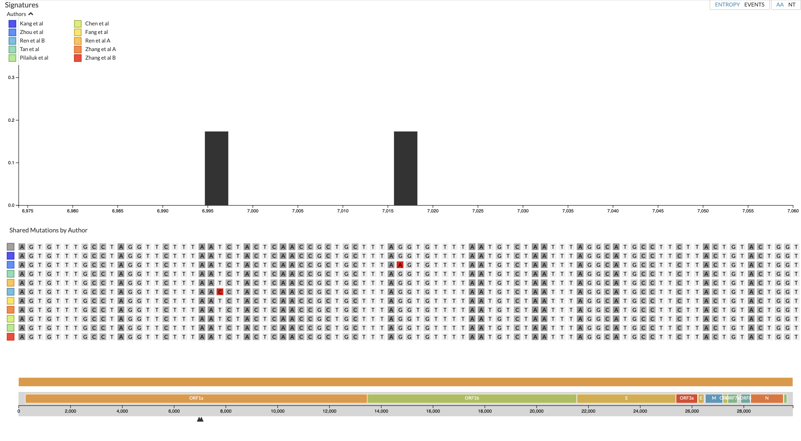
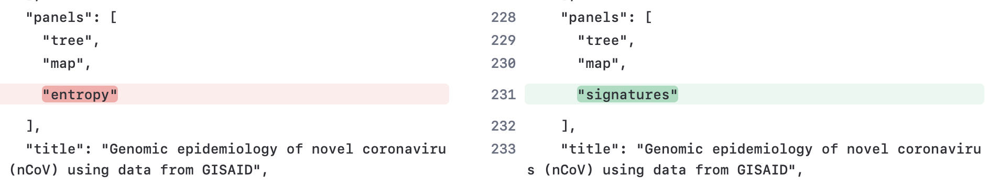

# RADx Adaptation Of Auspice

RADx has has been developing its own extension of Auspice forked on April 24, 2023. While there are currenlty no ambitions to merge code back into Auspice we will actively merge ongoing updates of Auspice into this version. 

## Differences In Interface

## Differences In Code

## Differences In JSON Files

There are tow main differences between the original entropy-style JSON files and the new signature-style files:

1) The signature JSON files need to list signature as a panel as shown below (ncov_signatures.json).
2) The corresponding root sequence file needs to be present (ncov_signatures_root-sequence.json).

