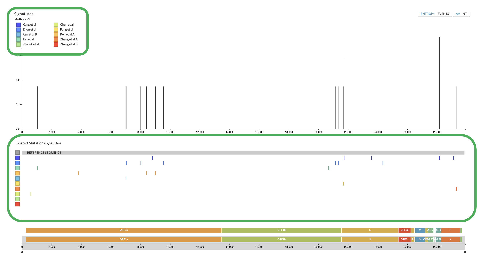
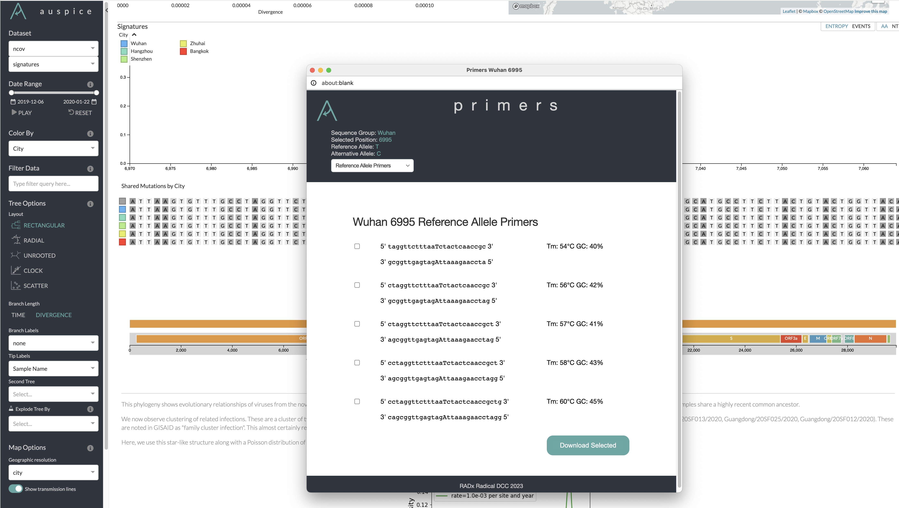

# RADx Adaptation Of Auspice

RADx has has been developing its own extension of Auspice forked on April 24, 2023. While there are currenlty no ambitions to merge code back into Auspice we will actively merge ongoing updates of Auspice into this version. The main purpose of our version is to be able to integrate functionality for creating easily designing DNA probes based on the dynamic groupings generated by Auspice.

In order to achieve this, we inserted a simulated multiple sequence alignment (MSA) into Auspices Entropy browser, between the Entropy plot and the zoomable gene representation (figures A01 and A02). The alignment exists as a representation of mutations within the different groupings as ticks when zoomed out. When zooming in close enough (either using the zooomable gene representation or by clicking on one of the ticks) the MSA appears (figure A02), depicting the presence of variations from the root sequence in red.

Clicking on any base, both root or variant will bring you to the primer/probe browser.

## Differences In Interface

The additions to Auspice interface are outlined in green in figures A1 and A2

Figure A01: MSA in "tick-mode"

Figure A02: Full MSA view with clickable bases to bring up respective primer designer.

Figure A03: Primer windows when launched from a variant base (in red on MSA) will allow user to choose to use root sequence or variant as basis for oligo design.

## Differences In JSON Input  Files

Auspice uses JSON files generated by Augur as the input for their sequence groupings. We have made slight changes to the JSON files used for the Entropy interfaces manually and are currently exploring how to update Augur in order to automate this process.  There are tow main differences between the original entropy-style JSON files and the new signature-style files:

1) The signature JSON files need to list signature as a panel as shown below (ncov_signatures.json).
2) The corresponding root sequence file needs to be present (ncov_signatures_root-sequence.json).

## Differences In Code

### Interface Changes

### Primer/Probe Browser

## Useful Links

[Running Auspice](https://docs.nextstrain.org/projects/auspice/en/stable/introduction/how-to-run.html)

